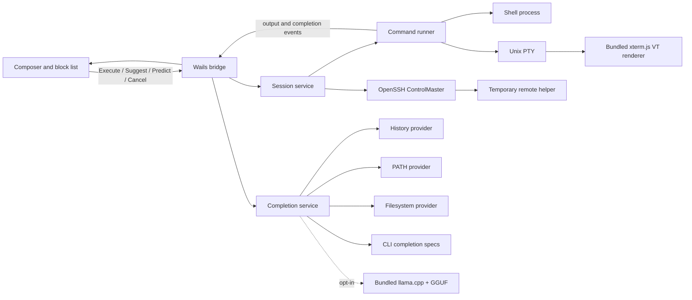
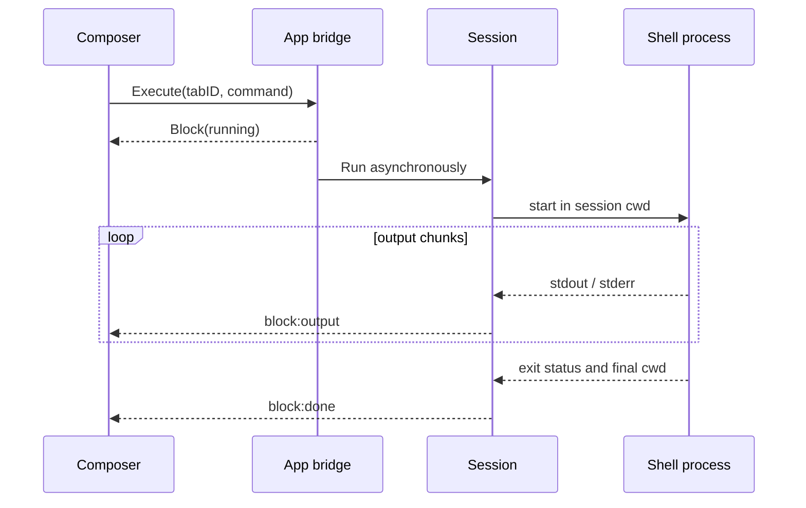

# Architecture

## Product model

```text
Workspace
  └── Tab
      └── Session (local shell or SSH channel)
          ├── Block (command + output + result metadata)
          └── Composer (editable command draft + suggestions)
```

The prototype instantiates one workspace with multiple local or SSH tabs. Every tab
owns an independent session, cwd, history, completion context and running
process. Appearance settings belong to the workspace; the configured default
directory and shell are used when a new tab is created.

## Decisions

### ADR-001: Go core with Wails v2 shell

Status: accepted for the prototype.

Wails uses the platform WebView rather than shipping a Chromium runtime. This
gives NTerm a native window, small distribution size and a DOM editor capable of
Warp-like composition. The Go core owns processes, sessions, persistence and
secrets. The WebView owns layout, text editing and rendering only.

The boundary is an event/API contract, so a future GPU renderer (Gio, Metal,
DirectWrite or Skia) can replace the frontend without changing terminal or SSH
services.

### ADR-002: blocks are domain objects, not styled terminal lines

A block has identity and lifecycle: queued, running, succeeded, failed or
cancelled. Command text, cwd, timestamps and exit status are metadata; output is
an append-only stream. This makes search, rerun, sharing and persistence
possible without scraping the screen.

### ADR-003: PTY execution with a dedicated alternate-screen surface

Every command now runs in a Unix PTY and the UI owns a bundled xterm.js VT state
machine. Ordinary output remains in immutable blocks. When a program selects an
alternate screen—or is a known full-screen application—the working area swaps
to the VT surface while retaining the native tab bar. Raw keyboard input and
window-size changes flow back to the PTY. Exiting restores the block list and
composer. Windows still requires a ConPTY adapter.

### ADR-004: completion is a provider pipeline

Fast deterministic providers always run first:

1. current session history;
2. shell built-ins and executables in `PATH`;
3. filesystem entries relative to session cwd;
4. built-in completion specs for common command subcommands and flags.

The optional local model runs in a separate request after the deterministic
results are already visible. Each tab cancels stale inference when input
changes, while a shared provider serializes model work across tabs and caches
valid predictions. The model never owns execution and every result must preserve
the exact editor prefix.

Providers return the same `Suggestion` type and are ranked/deduplicated by the
frontend. The local model has a short timeout and can never block the
deterministic result. NTerm owns a bundled llama.cpp sidecar and 0.5B quantized
model: it starts lazily, binds to loopback only, serializes inference across
tabs, unloads after 90 idle seconds and terminates with the application.

### ADR-005: secrets never enter the application database

Host metadata and secret references live in SQLite. Passwords and passphrases
live in the operating system credential vault. Private keys normally remain on
disk with their existing permissions. Clipboard operations involving secrets
are explicit, time-limited and never logged.

### ADR-006: SSH enhancement is temporary and connection-scoped

An interactive `ssh host` command starts the platform OpenSSH client as a
persistent ControlMaster. Each NTerm block uses a separate multiplexed channel,
so one authenticated transport supports streamed commands and `-L`/`-R`/`-D`
forwarding without an application-specific SSH dependency.

After connection, NTerm uploads a small POSIX helper to a mode-0700 temporary
directory. It performs bounded remote path completion, command discovery and
Git inspection. It is not a daemon, does not edit rc files and is removed by
`exit`, tab closure or app shutdown.

## Runtime components



## Package layout

```text
cmd / root main        Native window and dependency wiring
internal/domain        Stable block and session data contracts
internal/terminal      Shell process lifecycle and cwd state
internal/completion    Provider pipeline and local model adapter
internal/config        Validated, atomically persisted preferences
frontend/dist          Dependency-free editor and block renderer
scripts                Reproducible self-contained macOS packaging
```

Future packages:

```text
internal/pty           Future Windows ConPTY adapter and platform abstraction
internal/vt            Future native/GPU replacement for the bundled VT renderer
internal/ssh           Host profiles and host-key policy beyond the current managed OpenSSH transport
internal/store         SQLite repositories and migrations
internal/secrets       OS credential-vault adapters
```

No package below the root application layer imports Wails. Events are callbacks
at the terminal boundary and serializable domain values at the application
boundary.

## Command lifecycle



Only one process runs at a time inside a tab, while different tabs can run
concurrently. With PTY support, each tab will use an actor-like session loop
that serializes input, resize and signal messages for its PTY.

## Data contracts

`Block` contains:

- stable ID and command text;
- cwd at launch and cwd after completion;
- start/end timestamps and duration;
- state and exit code;
- output chunks tagged stdout/stderr.

Output is sent incrementally and should not be duplicated inside every event.
When persistence lands, chunks will be compacted into bounded compressed
segments and indexed separately from metadata.

## Security boundaries

- The renderer cannot spawn processes or read arbitrary files directly.
- Go validates empty commands and serializes session execution.
- Model completion is disabled by default and loopback-only when enabled.
- Environment snapshots, command output and prompts may contain secrets; logs
  must redact them and telemetry must remain opt-in.
- SSH host keys require explicit policy; `InsecureIgnoreHostKey` is forbidden.
- Database encryption is not a substitute for an OS credential store.

## Known prototype limitations

- Unix uses a PTY; Windows still needs its ConPTY implementation.
- ANSI support in the renderer covers common SGR colors, not the complete VT
  standard.
- Cwd persistence relies on a private descriptor written by the shell after a
  command; an explicit `exit` command may prevent the update.
- Completion currently assumes the caret is at the end of the draft. The next
  editor iteration passes caret/token ranges to providers.
